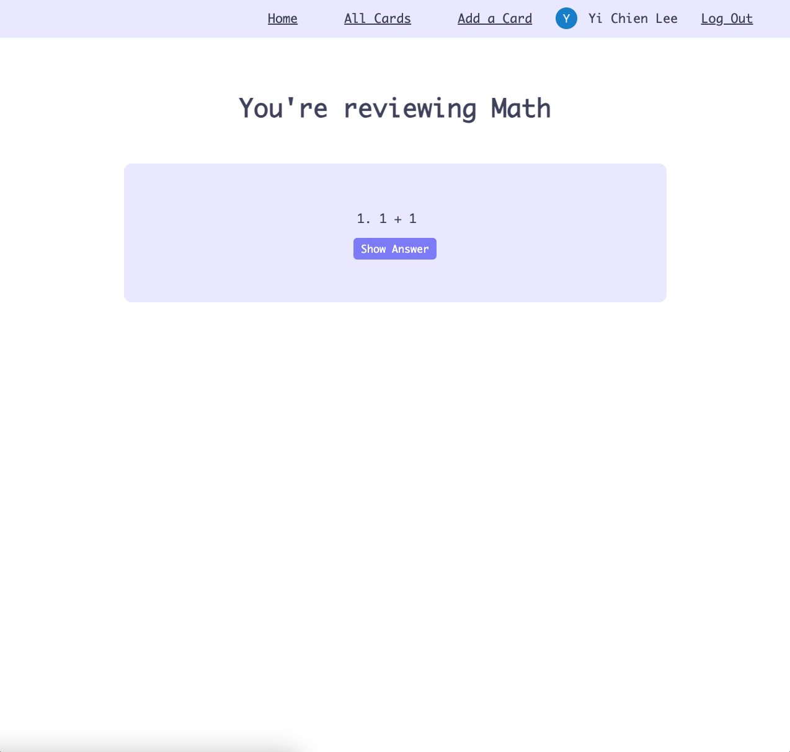

# Anki
Anki is a popular open-source, spaced repetition flashcard program. It allows users to create digital flashcards, which are then presented to them at intervals calculated to maximize retention and minimize the time spent studying. Anki uses a spaced repetition algorithm to determine when each card should be reviewed based on the user's performance in recalling the information. This method aims to help users efficiently memorize and retain large amounts of information over the long term. Anki is widely used by students, language learners, professionals, and anyone else seeking to memorize information effectively.

# Screenshot
## When not logged in

    
    

## During login

    
    
    
    
    
    
    
    

# Technologies Used
- Javascript (Node.js, Express.js, Password.js)
- Ejs
- CSS

# Getting Started
Link for my verison of [Anki](https://anki-notes-7bfcac26f812.herokuapp.com/).
1. You have the option to review decks added by other users as a visitor, or you can log in using your Google account to create your own cards and decks.
2. When logged in, you have full CRUD functionality for cards and decks that you created.
3. Now, it's time to review your card deck. Select a deck and reveal the cards. Try to think of the answer on your own, and then click the "Show Answer" button.
4. After reviewing a card, its due date will be updated. Wait until the next review time (default 30 seconds), at which point it will become due and you should review it again.

# Next Steps
Planned future enhancements:
- [ ] add `importCard` funcationality from 3rd party API
- [ ] add `exportCard` for user to dowload cards to local device
- [ ] provide `intervalSetting` to let user set their review pace 

Link for my [trello](https://trello.com/b/u4J9h1Jp/project-2) of this project. You can also find wireframe and entity relation diagram here.